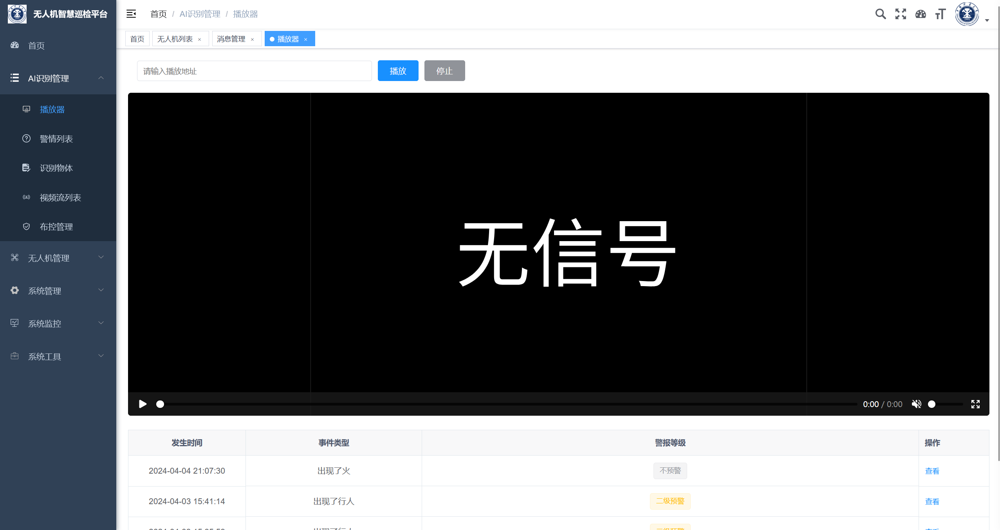

## 无人机智能巡检平台——后端服务模块
[](https://gitee.com/yuankunn/ai_detection/stargazers)

```若依``` ```Java``` ```SpringBoot2.5.14``` ```Mqtt``` ```定时任务``` ```WebSocket``` ```大疆无人机``` ```MySQL``` ```Mybatis-Plus```

项目说明：本项目基于若依框架搭建，可以对无人机进行监控，包括视频监控、不安全行为分析、无人机状态监控、权限管理、不安全行为预警。本开源项目是后端服务模块。

最近学业繁忙，如果大家有疑问直接提issue，我会尽快回复，项目中还有一些功能未实现，欢迎大家提pr。

默认登录账号密码：admin admin123

总共有四大模块：视频分析模块（C++）、后端服务模块（基于若依）、流媒体服务模块、前端展示模块（Vue）

项目运行，git克隆后，先下载依赖，jdk版本是1.8，点击运行即可。

打包成jar方法：1.Maven里面点击下面图片这个,先点击1，然后点击2


2.确保ruoyi-admin目录下面pd文件夹中有内容，如果没有就多clean几遍


3.然后点击install后，会发现admin/target目录下生成了jar包，然后运行右键运行即可


项目运行所需要的环境：MySQL5.7（我用的5.7，其他版本自测）、Redis

项目特色：

- 调用更改后的YoloV8s模型，进行无人机拍摄的不安全行为实时检测。
- 使用RTSP进行拉流，从无人机网关拉取无人机视频流，使用Mqtt订阅无人机的消息（proto3）语法。
- 可以对预警信息生成Excel表单，实时展示系统预警状态以及各类指标。
- 支持大屏展示，使用WebSocket进行数据交互，降低服务器压力。
- 可以规划预警区域，只有无人机进入规划的预警区域才会发生预警行为。（开发中）
- 自定义识别的参数：置信度，识别的物体类别；自定义报警参数：预警最短时间间隔，预警类别等。
- 可以对视频流进行识别开始，识别终止等操作。
- 视频分析模块与后端服务模块，采用接口交互，降低耦合，方便单独拿出使用。（视频分析模块已经开源）

工作大致流程：使用ZlmediaKit流媒体服务器接受从无人机网关的视频流，然后收到Mqtt消息根据用户设置进行开始识别，调用视频分析模块进行拉流处理，解帧，得到视频帧，对帧画面使用Tensorrt推理加速处理视频帧，使用OpenCV对视频帧进行画框，然后合成帧，推流到ZlmediaKit流媒体服务器。前端使用Flv.js进行播放，如果出现设定的预警标准，会进行弹窗预警以及生成预警信息。

项目截图：
